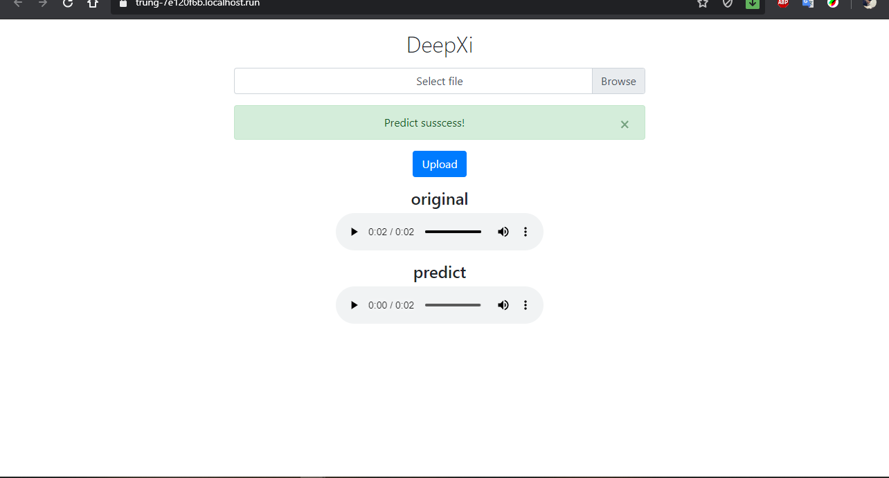

# deepxi-flask-server
**DeepXi (Audio Denoise with Deep Neural Network) | Flask Frontend Demo**  
+ **Run flask server:**  
```
python flask_server.py  
```
+ open `https://localhost:8080` in browser
  

